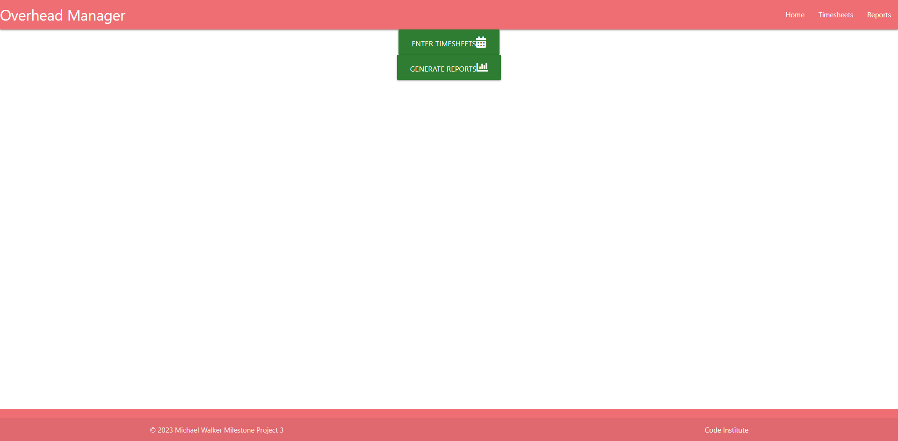
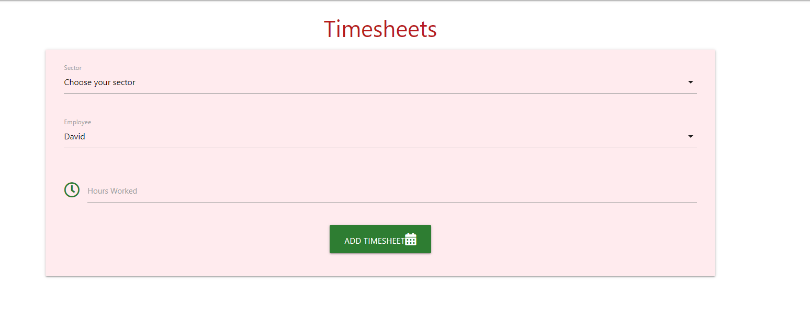
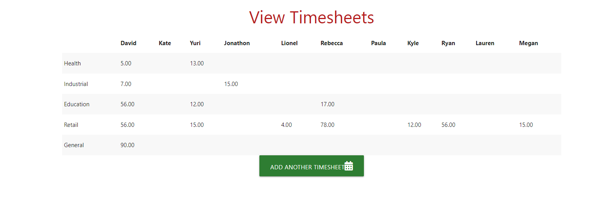
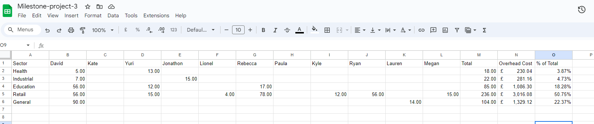
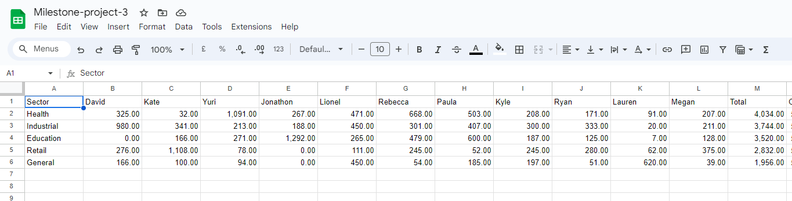

# Overhead Manager

Overhead Manager is a simple to use timesheet platform where you can post your work hours based upon your work sector. The example used is based on some previous real life work undertaken in an architects firm. The data used, uses actual overhead costing but the names and values have all changed due to confidentiality. The idea originally arose from a period of work experience undertaken where I worked out the cost analysis and management reports for the company to help them work out their profitability ratios per sector.

Overhead Manager

# User Stories

## User Goals

* To provide the user with an easy to navigate timesheet portal to track hours worked in a specific sector.
* To present the user with a layout that is easy to understand and read.
* To allow the user to view graphs of previous financial years results and current expectations.

### As a user I want to:

* I want to understand the main purpose of the website.
* I want to be able to naavigate the website, understand the concept of the website and use the website confidently.
* I want to be able to discuss the website with other potential users.

# Design

## Imagery and colour scheme

* The colour scheme of the site was given careful consideration. The colours used in the website is important to the overall experience of the user.
* The colour scheme was chosen based on what colours are easy on the eye and also bearing in the mind the colour scheme of accounting software.
* Once the colours were chosen, it was a test to see if they blended together, the gentle red is easy on the eye and the green is just enough to capture the attention of where the user needs to go.
  
## Layout

The website is split into 3 sections:

* Home
* Timesheets
* Reports

## Timesheets and reports features

### Timesheet Page

* When the user clicks the timesheet page, this is what they are greeted with.
    * They then choose the sector they wish to post into,
    * Their name,
    * How many hours they worked
*  After this they are then greeted with a view of the current state of hours worked in the month  

* After this, the use can choose to input another timesheet where they will be redirected back to the front page to be able to post another timesheet.

### Reports Section

* This is the section where the user can view data from previous financial years to compare how long they spent working on projects in other sectors.
* This is for the management to look at as the data in here would grasp on teh financials and show you in a clear concise way where time is being spent as well as where the money is being earned.

### Layout change

* The layout of the website changed mostly due to the idea being changed. Originally this was going to be a cost managment system for manufacturing products, however, this idea would have been over time consuming and impractical. The idea became to just focus on the analytical areas on the information I already had stored from my time working in the company.
* The idea still pulls through from the google sheet, using two different ones for the different sections. Timesheets uses the current month sheet, where reports uses the old financial year sheet.

# Testing

### Validator testing
  - ## HTML
    - No errors were returned after passing code through official W3C Markup Validator.
  - ## CSS
    - No errors were found when passing CSS code through official W3C CSS Validator.
  - ## JavaScript
    - No errors were returned when passing through the JSHint Validator.
  - ## Python
    - No errors were returned when passing through Pep8.
    - This was also checked through pythonchecker.com for hints on indentation and syntax.

### Button testing

- All buttons were tested manually to make sure the navigation for the user was correct.

### Timesheet testing

- The timesheet section of the application was tested through viewing the google sheet and the terminal side by side. Using print() functions within the code, and running the project on the web browser to check that the terminal returned the same variables in the correct position of the sheet and posted into the right cell. This was done by using an index +2, to make sure it didn't post to the wrong sector or person.

### Reports testing

- This wasn't fully complete as this was used to test pulling data from the sheet and using plotly to be able to post a graph on view. This would have been further advanced by splitting different replorts into sub-sections and the graphs would appear after a loading bar after the user chose the section of reports they wanted to look at.

### Bugs fixed in development process

### Error posting values in the correct cell
* When populating the timesheet table, the cells were populating to the wrong person and wrong sector by one notch. So to corect this, I added a +2 to the index and this lined it up perfectly. 
* Unable to deploy to Heroku due to a line line 2172, in <module>
                 register_finder(pkgutil.ImpImporter, find_on_path)
                                 ^^^^^^^^^^^^^^^^^^^
             AttributeError: module 'pkgutil' has no attribute 'ImpImporter'. Did you mean: 'zipimporter'?
             [end of output]
Unfortunately, I couldn't fix this in time and so the project was not deployed properly.
* Plotly graph not being populated with my information and just posting an X, Y Axis. This was fixed by posting in the script source for the graph in which i posted to the bottom of the page, rather than the top. So the load process was in the wrong order.

# Technologies used

### Languages used

- JavaScript
- HTML
- CSS
- Python

### Programs used

- https://stackoverflow4.com - Used to get advice and tips on how to print from and to google sheets.
- https://github.com/ - Used for hosting.
- https://plotly.com - Used for creation of reports.
- https://elephantsql.com - Used to database link for app
- https://heroku.com - Used to deploy the app

### External resources used

- https://stackoverflow.com/ - Used to help get the formula and syntax for printing to and from google sheets.
- https://materializecss.com/ - used to set up pages and format the style

### Media

# Deployment

Before deploying to Heroku pip3 freeze > requirements.txt was used to add all the dependencies required to the requirements.txt file. This is required for the game to run on Heroku.

The following steps were then taken:

1. Log in to Heroku or create an account.
2. On the main page click the button labelled New in the top right corner and from the drop-down menu select "Create New App".
3. Enter a unique and meaningful app name.
4. Next select your region.
5. Click on the Create App button.
6. Click on the Settings Tab and scroll down to Config Vars.
7. Enter DATABASE_URL and paste in elephantsql.com link
8. Click Reveal Config Vars and enter port into the Key box and 5000 into the Value box and click the Add button.
9. Input CREDS and the content of your Google Sheet API creds file as another config var and click add.
10. In the next Key box enter OXFORD_API_APP_ID and add your unique ID to the value box.
11. In the next Key box enter OXFORD_API_APP_KEY and add your unique key to the value box.
12. Next, scroll down to the Buildpack section click Add Buildpack select Python and click Save Changes
13. Repeat step 11 to add node.js. Note: The Buildpacks must be in the correct order. If not click and drag them to move into the correct order.
14. Scroll to the top of the page and choose the Deploy tab.
15. Select Github as the deployment method.
16. Confirm you want to connect to GitHub.
17. Search for the repository name and click the connect button.
18. Scroll to the bottom of the deploy page and either click Enable Automatic Deploys for automatic deploys or Deploy Branch to deploy manually. Manually deployed branches will need re-deploying each time the repo is updated.
19. Click View to view the deployed site.
The site is now live and operational!

# Ideas for Improvement

### Development

* Insert a project page where the user can view, amend and update any projects currently in action; whilst then setting a due date and marking them as complete and archiving or deleting.
* Make the timesheet page postable for individual days, with a cap of 7.5 hours a day (or equivalent of hours they work in the day) rather than a cumulative total of hours spent on the sector and make this add to the current total in month, whiilst also being capped at the total hours for the month available. (Also being able to post holiday hours and use the non-working overhead variable rate)
* Timesheets applicable to the projects being worked on, and the sector autofills. So can work out costing per project as well as per sector. More definable variables.
* Live reports page where you can work on old financial year totals as well as current year totals and comparisons.
 - Ability to compare the revenue coming in from a project, and the overhead costs currently incurred on it. Whether it be by variable rate or charge out rate.
 - Ability to see current profit projections based on work completed.

### Credits

* The slack community as well as my mentor Anto for timely responses and great feedback!

